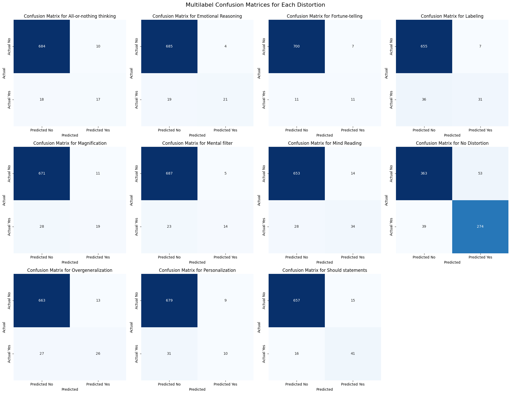

# PsycheZero

## Overvie
Introducing psychezero, an mental health chatbot that stores user memory and helps user equip with psychological concepts with legit source via RAG. 

To optimize rag retrieval techniques such as chunking, recursive splitting,semantic retrival, reranking are implemented and to overcome users lack of psychology jargons, Hyde have being implemented that increase retrieval score.

## Dataset
In order to make fast and accurate classification, I have fine tuned ModernBert with 2 datasets on CBT classification tasks 
1. Cognitive Distortion detetction dataset on kaggle:https://www.kaggle.com/datasets/sagarikashreevastava/cognitive-distortion-detetction-dataset/data
2. Cognitive Distortion Dataset for Text Classification in Bahasa Indonesia: https://data.mendeley.com/datasets/k84bkv8dkt/4

 over these labels
['All-or-nothing thinking',
 'Emotional Reasoning',
 'Fortune-telling',
 'Labeling',
 'Magnification',
 'Mental filter',
 'Mind Reading',
 'No Distortion',
 'Overgeneralization',
 'Personalization',
 'Should statements']

### Model Performance

| Cognitive Distortion | Precision | Recall | F1-Score | Support |
| :--- | :---: | :---: | :---: | :---: |
| All-or-nothing thinking | 0.63 | 0.49 | 0.55 | 35 |
| Emotional Reasoning | 0.84 | 0.53 | 0.65 | 40 |
| Fortune-telling | 0.61 | 0.50 | 0.55 | 22 |
| Labeling | 0.82 | 0.46 | 0.59 | 67 |
| Magnification | 0.63 | 0.40 | 0.49 | 47 |
| Mental filter | 0.74 | 0.38 | 0.50 | 37 |
| Mind Reading | 0.71 | 0.55 | 0.62 | 62 |
| No Distortion | 0.84 | 0.88 | 0.86 | 313 |
| Overgeneralization | 0.67 | 0.49 | 0.57 | 53 |
| Personalization | 0.53 | 0.24 | 0.33 | 41 |
| Should statements | 0.73 | 0.72 | 0.73 | 57 |
| **micro avg** | **0.77** | **0.64** | **0.70** | **774** |
| **macro avg** | **0.70** | **0.51** | **0.58** | **774** |
| **weighted avg** | **0.76** | **0.64** | **0.68** | **774** |
| **samples avg** | **0.64** | **0.66** | **0.64** | **774** |

